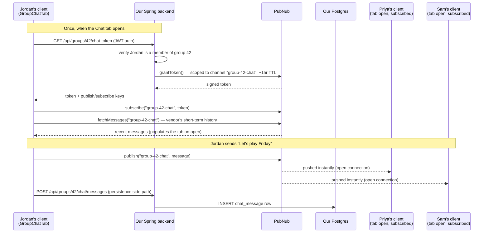

# Chat service integration — PubNub

**Date:** 2026-07-22
**Status:** Agreed (discussion between repo owner + Claude)
**Supersedes:** `PROGRESS.md`'s "Real-Time Chat (designed, not implemented)" entry, which previously
planned self-hosted WebSocket/Spring STOMP (dependency already sitting unused in
`server/build.gradle`) — see "Why not self-host" below for why that plan changed.
**Unblocks:** `modules/social/chat-impl/docs/BACKLOG_MVP.md` (CHAT-1, CHAT-3),
`client/docs/BACKLOG_MVP.md` (CHAT-2, CHAT-4)

---

## Decision

**Use PubNub** as a 3rd-party realtime pub/sub transport for group chat, wired headlessly (their JS
client only — no bundled UI) underneath the chat UI already built in GRP-1
(`client/src/features/groups/components/GroupChatTab.tsx`). Our own Spring backend mints short-lived,
membership-scoped access tokens; message history is additionally persisted in our own Postgres so
we're never vendor-locked for our own data.

**Scope boundary for this integration: group chat only**, matching what `GroupChatTab.tsx` already
is. 1-on-1 direct messages remain a separate, unscoped future item (`PROGRESS.md`'s longer-term
roadmap already lists both "1-on-1 direct messages, group chats" together — this decision only
covers the group half). Text-only messages — neither the design reference
(`client/design-reference/design-reference-group-feed.html`) nor the current UI shows attachments,
read receipts, or typing indicators, so none of those are in scope here either.

---

## Why not self-host (Spring STOMP)

The original roadmap plan was a self-hosted WebSocket layer (`spring-boot-starter-websocket` is
already a dependency, unused). The problem: this project's hosting is deliberately minimal —
`infra/documentation/INFRA-3_HOSTING_DECISION.md` runs everything on a single free-tier EC2 instance
(1 vCPU / 1GB RAM), explicitly because "cost avoidance drives every choice" for this solo/learning
project. A self-hosted realtime layer means:

- Holding open, stateful WebSocket connections per active chat participant, directly competing with
  the Spring Boot app + Redis containers already sharing that 1GB of RAM.
- Building and operating our own fan-out logic, connection lifecycle handling, and horizontal-scaling
  story (none of which exist today) for something that isn't this app's core product.

A 3rd-party pub/sub vendor moves all of that onto the vendor's infrastructure — the EC2 box only ever
makes a handful of short-lived HTTP calls (mint a token, optionally persist a message), never holds a
chat connection open itself.

## Why not build vs. buy the same way auth did

`modules/auth/docs/KEYCLOAK_VS_CUSTOM_AUTH.md` chose custom-built over a 3rd-party identity provider
(Keycloak) for this same project. That doesn't generalize to chat, for two reasons specific to each
domain:

1. **Keycloak would have added infrastructure burden** (a separate service, more RAM) on the same
   resource-constrained box — the opposite of what a pub/sub *SaaS* does (offloads load, doesn't add
   it).
2. **Identity is core IP for a social app; realtime chat transport is not.** Auth needed deep,
   ongoing customization tied to this app's own user/role model. A group chat message box doesn't.

---

## Vendor comparison

Verified against each vendor's current published pricing/docs (2026-07):

| Vendor | Free tier | Headless (no bundled UI)? | Verdict |
|---|---|---|---|
| **PubNub** | Permanent, no card required: 200 MAU, 1M transactions/mo, 1GB storage w/ **7-day** message history included | Yes — SDK is pure pub/sub | **Chosen** |
| Ably | Permanent, no card required: 200 concurrent connections, 6M messages/mo, only **1-day** message history on the free tier | Yes | Close second — would also work; shorter free-tier history is the only real gap vs. PubNub |
| Stream Chat | Free "Build" tier is explicitly dev/prototype-only: 500 MAU, 30-day retention. Production tiers start at **$399–499/mo** for 10,000 MAU | No by default (ships `stream-chat-react` UI kit; a lower-level client exists but the product leads with the UI kit) | Rejected — real cost cliff for a cost-avoidance project, and the UI kit doesn't fit "no second styling system" (`client/CLAUDE.md`) |
| Sendbird | Marketing leads with "1,000 MAU free," which is actually a 30-day Pro trial. The permanent free "Developer" plan is ~100 MAU / 10 concurrent connections | No (leads with Sendbird UIKit) | Rejected — misleadingly small permanent tier, plus the same UI-kit conflict as Stream |

**Why PubNub over Ably specifically:** both are permanently free at this project's scale and equally
headless; PubNub's 7-day built-in history (vs. Ably's 1 day) gives a better interim experience before
our own persistence (CHAT-3) ships, and is the tie-breaker.

Sources checked: PubNub pricing/support docs, Ably pricing docs, GetStream.io pricing, Sendbird
pricing/CometChat comparison — all fetched live during this session, not from training-data
recollection (vendor pricing changes too often to trust stale knowledge here).

---

## Architecture



### Channel model

One PubNub channel per group: `group-{groupId}-chat`. A group is already 1:1 with its own membership
list (`GroupMember`), so this maps naturally — no separate "conversation" concept needed for the
group-chat-only scope decided above.

### Token minting and membership gating

The backend never hands out a long-lived token. Each time the Chat tab is opened, the client calls a
new endpoint that:
1. Resolves the caller's identity from the JWT (`@AuthenticationPrincipal`, same pattern every other
   `GroupController` endpoint already uses).
2. Checks `GroupService.isGroupMember(groupId, userId)` — the existing method at
   `modules/social/group-api/src/main/java/com/sportconnect/group/api/service/GroupService.java:97`,
   called cross-domain through the `-api` interface only (never `group-impl` directly), per
   `CLAUDE.md`'s monolith-first rule. Non-members get a 400, same convention as every other
   membership-gated endpoint in `GroupController`.
3. Calls PubNub's Java Access Manager SDK (`grantToken()`, `com.pubnub:pubnub-gson` artifact) to mint
   a token scoped to exactly that one channel, with a short TTL (~1 hour — matches this app's
   existing short-lived, in-memory JWT access-token posture rather than reaching for either vendor's
   multi-day ceiling).

**Revocation:** deliberately **not built for MVP**. A user who leaves a group (`DELETE
/api/groups/{groupId}/leave`, already real since GRP-1) simply can't mint a *new* token for that
channel anymore — but a token they already hold in the browser stays valid until it naturally
expires. Since the TTL is ~1 hour, that's the maximum exposure window. PubNub does support actively
revoking an already-issued token (`revoke_token()`), but it requires enabling a dashboard flag and
adds a real API call on every leave/kick — not worth the complexity for a gap already bounded to
under an hour. Revisit if "instant removal" (e.g. an owner kicking someone mid-conversation) becomes
a real product requirement.

### Message payload

PubNub accepts arbitrary JSON (not raw text), up to 32 KiB per message (recommended under ~1,800
bytes for best latency) — a non-issue at this app's message-length scale (reusing the existing
1,000-character comment-length cap, `MAX_COMMENT_LENGTH`, for chat messages too). We define the
payload shape ourselves, e.g.:

```json
{
  "id": "client-generated-uuid",
  "senderId": "user-uuid",
  "senderFullName": "Jordan Lee",
  "content": "Let's play Friday",
  "sentAt": "2026-07-22T10:15:00Z"
}
```

No binary/file attachments through the channel — out of scope per the boundary above; would need the
same media-upload path the app uses elsewhere, with only a URL reference in the JSON payload, if ever
scoped later.

### Persistence

The vendor's own history (`fetchMessages()`, 7 days on the free tier) is enough to bridge the gap
until real persistence ships, but is not the system of record. A new domain-scoped `chat_message`
table (Postgres, no cross-domain foreign key — `group_id`/`sender_id` are IDs only, per `CLAUDE.md`)
is the actual source of truth:

- The client publishes to PubNub for real-time delivery **and** calls our backend to persist — the
  persistence write is a side path off the critical delivery path, never blocking it (see the
  diagram: Priya and Sam get the message from PubNub regardless of whether the persistence call
  succeeds).
- `senderFullName` is resolved **server-side** via `UserService.getUsersByIds(List<UUID>)` (already
  exists, `modules/user/user-api/src/main/java/com/sportconnect/user/api/service/UserService.java:28`)
  — never trusted from the client payload, since a client could otherwise claim any name. Batched
  over all distinct senders in a page, not looked up per-message, per `CLAUDE.md`'s explicit N+1
  rule.
- This keeps us not vendor-locked: switching pub/sub vendors later is inconvenient (re-plumb the
  transport) but never data-destructive (our own table is untouched).

---

## What this unblocks

Full ticket breakdown lives in two backlogs (backend and client tickets are interleaved by
dependency — see each file's own dependency notes):

- `modules/social/chat-impl/docs/BACKLOG_MVP.md` — **CHAT-1** (module scaffolding + token-issuing
  endpoint), **CHAT-3** (message persistence)
- `client/docs/BACKLOG_MVP.md` — **CHAT-2** (wire `GroupChatTab` to real-time PubNub delivery),
  **CHAT-4** (persisted history + hardening)

Sequencing: CHAT-1 → CHAT-2 (real-time works end-to-end, backed by the vendor's own short-term
history) → CHAT-3 (our persistence exists) → CHAT-4 (client swaps to it, hardens, closes out the
"not saved" disclaimer that's been in `GroupChatTab.tsx` since GRP-1).
