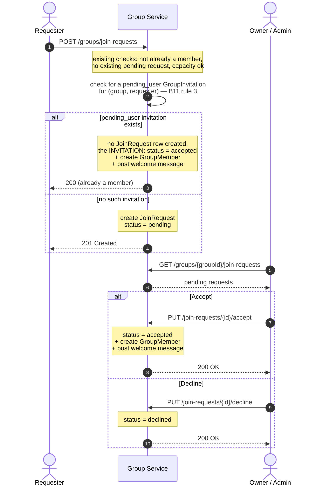
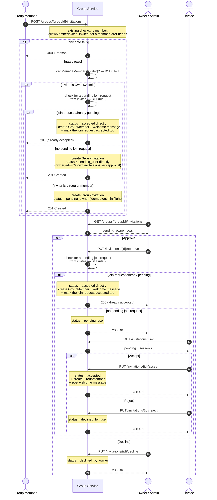

# ADR: Group Membership Requests — Join Requests vs. Invitations Schema

**Status:** Open — deliberation record, no schema change made. Current recommendation: **keep the
two tables (Schema A)**. Written 2026-07-23 while scoping GRP-7 (client ticket wiring the
invitation approve/accept lifecycle), after the question came up of whether `group_join_requests`
and `group_invitations` should be merged into one table. **§5 (added same day) is the canonical,
diagrammed reference for backend ticket B11** — read it before implementing B11, not just that
ticket's prose; keep §5 in sync if B11's rules change during implementation, don't let the two
documents drift.

**Context:** SportConnect has two independent ways a user ends up as a `GroupMember`: they request
to join themselves (self-service), or an existing member invites them (member-initiated). Both are
"pending decision" workflows with an approval step, which is what raises the question of whether
they should share a table. This doc records every use case both flows support today, both candidate
schemas, and the pros/cons of each — so the "didn't we already think about this?" question has an
answer next time it comes up.

---

## 1. All use cases and actions

Two backend flows exist today, both in `modules/social/group-impl`, both fully shipped
(`GroupServiceImpl`/`GroupController`, base path `/api/groups`). 13 actions total.

### Flow 1 — Join requests (self-service). Entity: `GroupJoinRequest` / table `group_join_requests`

| # | Actor | Action | Endpoint | Effect |
|---|---|---|---|---|
| UC-1 | Any user | Requests to join a group by name | `POST /groups/join-requests` | Creates a row, `status='pending'`. One pending request per (group, user) — enforced by a DB partial unique index. |
| UC-2 | Owner/Admin | Views their group's pending join requests | `GET /groups/{groupId}/join-requests` | 400 for a non-owner/admin caller. |
| UC-3 | Owner/Admin | Accepts a join request | `PUT /groups/join-requests/{id}/accept` | Row → `accepted`; creates a `GroupMember` row; posts the `GROUP_SYSTEM` welcome message. |
| UC-4 | Owner/Admin | Declines a join request | `PUT /groups/join-requests/{id}/decline` | Row → `declined`. |
| UC-5 | The requester | Views their own sent join requests | `GET /groups/join-requests/user/{userId}` | Backs `pendingGroupIds` in `JoinGroupModal` — shows "Pending" instead of a second "Request to join" button. |

**Gating:** none beyond authentication — any user can request to join any (non-full) group. Single
reviewer (owner/admin), single approval step.

### Flow 2 — Invitations (member-initiated). Entity: `GroupInvitation` / table `group_invitations` (B1)

| # | Actor | Action | Endpoint | Effect |
|---|---|---|---|---|
| UC-6 | An existing group member | Invites a friend | `POST /groups/{groupId}/invitations` | Creates a row, `status='pending_owner'` — **unconditionally**, even if the inviter is the owner. Gated on: inviter is a group member, group's `allowMemberInvites` setting is `true`, invitee isn't already a member, inviter and invitee are friends (`UserFriendService.areFriends`). Idempotent re-invite: returns the existing in-flight row instead of erroring. |
| UC-7 | Owner/Admin | Views invitations awaiting their approval | `GET /groups/{groupId}/invitations` | Returns only `pending_owner` rows for that group; 400 for non-owner/admin. |
| UC-8 | Owner/Admin | Approves an invitation | `PUT /groups/invitations/{id}/approve` | Row → `pending_user`. (TODO in the code: notify the invitee — no notification system exists, see `ADR.md#in-app-notification`.) |
| UC-9 | Owner/Admin | Declines an invitation | `PUT /groups/invitations/{id}/decline` | Row → `declined_by_owner`. |
| UC-10 | The invitee | Views their own pending invitations, across *all* groups | `GET /groups/invitations/user` | Returns only `pending_user` rows where `invitee_id` = caller — not group-scoped. |
| UC-11 | The invitee | Accepts an invitation | `PUT /groups/invitations/{id}/accept` | Row → `accepted`; creates a `GroupMember` row; posts the welcome message, crediting the original inviter. |
| UC-12 | The invitee | Rejects an invitation | `PUT /groups/invitations/{id}/reject` | Row → `declined_by_user`. |
| UC-13 | The inviter (any member) | Views invitations *they personally* sent for a group | `GET /groups/{groupId}/invitations/sent` | Both `pending_owner` and `pending_user` rows in one page — backs GRP-3's "Waiting for user accept" section. |

**Gating:** membership + `allowMemberInvites` + friendship, on top of the reviewer check. **Two
sequential reviewers** (owner/admin, then the invitee) — a strictly longer approval chain than join
requests', and the only flow with a friends-gate at all.

### Use case diagram

Proper UML notation (stick-figure actors, oval use cases, a system boundary box) — Mermaid has no
native support for this, so it's hand-authored SVG. Teal = join-request flow, rose = invitation
flow; the Owner/Admin actor spans both since they review both flows.

<svg viewBox="0 0 1040 760" xmlns="http://www.w3.org/2000/svg" role="img" style="max-width:100%;height:auto;background:#fff"
     aria-label="UML use case diagram: Requester and Owner/Admin actors connect to the join-request use cases; Group Member, Owner/Admin, and Invitee actors connect to the invitation use cases; all thirteen use cases sit inside the Group Membership system boundary.">
  <defs>
    <g id="stickfigure" fill="none" stroke="#16201d" stroke-width="2.5" stroke-linecap="round" stroke-linejoin="round">
      <circle cx="0" cy="-34" r="9" fill="#ffffff" />
      <line x1="0" y1="-25" x2="0" y2="8" />
      <line x1="-13" y1="-15" x2="13" y2="-15" />
      <line x1="0" y1="8" x2="-12" y2="28" />
      <line x1="0" y1="8" x2="12" y2="28" />
    </g>
  </defs>
  <rect x="230" y="105" width="580" height="575" rx="10" fill="#ffffff" stroke="#dde2df" stroke-width="1.5" />
  <text x="520" y="132" text-anchor="middle" font-family="monospace" font-size="12" letter-spacing="2" fill="#5c6864">«SYSTEM» GROUP MEMBERSHIP</text>
  <g stroke="#00695c" stroke-width="1.5" opacity="0.55">
    <line x1="100" y1="390" x2="350" y2="190" /><line x1="100" y1="390" x2="350" y2="590" />
    <line x1="520" y1="55" x2="350" y2="290" /><line x1="520" y1="55" x2="350" y2="390" /><line x1="520" y1="55" x2="350" y2="490" />
  </g>
  <g stroke="#ad1457" stroke-width="1.5" opacity="0.55">
    <line x1="520" y1="55" x2="690" y2="236" /><line x1="520" y1="55" x2="690" y2="302" /><line x1="520" y1="55" x2="690" y2="368" />
    <line x1="940" y1="170" x2="690" y2="170" /><line x1="940" y1="170" x2="690" y2="632" />
    <line x1="940" y1="500" x2="690" y2="434" /><line x1="940" y1="500" x2="690" y2="500" /><line x1="940" y1="500" x2="690" y2="566" />
  </g>
  <g font-size="10.5" text-anchor="middle" font-family="sans-serif">
    <g><ellipse cx="350" cy="190" rx="88" ry="24" fill="#e0f2f1" stroke="#00695c" stroke-width="1.5" /><text x="350" y="187" font-family="monospace" font-weight="700" fill="#00695c">UC-1</text><text x="350" y="201" fill="#16201d">Request to Join</text></g>
    <g><ellipse cx="350" cy="290" rx="88" ry="24" fill="#e0f2f1" stroke="#00695c" stroke-width="1.5" /><text x="350" y="287" font-family="monospace" font-weight="700" fill="#00695c">UC-2</text><text x="350" y="301" fill="#16201d">Pending Requests</text></g>
    <g><ellipse cx="350" cy="390" rx="88" ry="24" fill="#e0f2f1" stroke="#00695c" stroke-width="1.5" /><text x="350" y="387" font-family="monospace" font-weight="700" fill="#00695c">UC-3</text><text x="350" y="401" fill="#16201d">Accept Request</text></g>
    <g><ellipse cx="350" cy="490" rx="88" ry="24" fill="#e0f2f1" stroke="#00695c" stroke-width="1.5" /><text x="350" y="487" font-family="monospace" font-weight="700" fill="#00695c">UC-4</text><text x="350" y="501" fill="#16201d">Decline Request</text></g>
    <g><ellipse cx="350" cy="590" rx="88" ry="24" fill="#e0f2f1" stroke="#00695c" stroke-width="1.5" /><text x="350" y="587" font-family="monospace" font-weight="700" fill="#00695c">UC-5</text><text x="350" y="601" fill="#16201d">My Requests</text></g>
  </g>
  <g font-size="10" text-anchor="middle" font-family="sans-serif">
    <g><ellipse cx="690" cy="170" rx="94" ry="22" fill="#fce4ec" stroke="#ad1457" stroke-width="1.5" /><text x="690" y="167" font-family="monospace" font-weight="700" fill="#ad1457">UC-6</text><text x="690" y="180" fill="#16201d">Invite Friend</text></g>
    <g><ellipse cx="690" cy="236" rx="94" ry="22" fill="#fce4ec" stroke="#ad1457" stroke-width="1.5" /><text x="690" y="233" font-family="monospace" font-weight="700" fill="#ad1457">UC-7</text><text x="690" y="246" fill="#16201d">Pending Approvals</text></g>
    <g><ellipse cx="690" cy="302" rx="94" ry="22" fill="#fce4ec" stroke="#ad1457" stroke-width="1.5" /><text x="690" y="299" font-family="monospace" font-weight="700" fill="#ad1457">UC-8</text><text x="690" y="312" fill="#16201d">Approve Invite</text></g>
    <g><ellipse cx="690" cy="368" rx="94" ry="22" fill="#fce4ec" stroke="#ad1457" stroke-width="1.5" /><text x="690" y="365" font-family="monospace" font-weight="700" fill="#ad1457">UC-9</text><text x="690" y="378" fill="#16201d">Decline Invite</text></g>
    <g><ellipse cx="690" cy="434" rx="94" ry="22" fill="#fce4ec" stroke="#ad1457" stroke-width="1.5" /><text x="690" y="431" font-family="monospace" font-weight="700" fill="#ad1457">UC-10</text><text x="690" y="444" fill="#16201d">My Invitations</text></g>
    <g><ellipse cx="690" cy="500" rx="94" ry="22" fill="#fce4ec" stroke="#ad1457" stroke-width="1.5" /><text x="690" y="497" font-family="monospace" font-weight="700" fill="#ad1457">UC-11</text><text x="690" y="510" fill="#16201d">Accept Invite</text></g>
    <g><ellipse cx="690" cy="566" rx="94" ry="22" fill="#fce4ec" stroke="#ad1457" stroke-width="1.5" /><text x="690" y="563" font-family="monospace" font-weight="700" fill="#ad1457">UC-12</text><text x="690" y="576" fill="#16201d">Reject Invite</text></g>
    <g><ellipse cx="690" cy="632" rx="94" ry="22" fill="#fce4ec" stroke="#ad1457" stroke-width="1.5" /><text x="690" y="629" font-family="monospace" font-weight="700" fill="#ad1457">UC-13</text><text x="690" y="642" fill="#16201d">Sent Invitations</text></g>
  </g>
  <g font-family="sans-serif">
    <g transform="translate(100,390)"><use href="#stickfigure" /><text x="0" y="48" text-anchor="middle" font-size="12.5" font-weight="600" fill="#16201d">Requester</text><text x="0" y="63" text-anchor="middle" font-size="10" fill="#5c6864">any user</text></g>
    <g transform="translate(520,55)"><use href="#stickfigure" /><text x="0" y="48" text-anchor="middle" font-size="12.5" font-weight="600" fill="#16201d">Owner / Admin</text><text x="0" y="63" text-anchor="middle" font-size="10" fill="#5c6864">reviews both flows</text></g>
    <g transform="translate(940,170)"><use href="#stickfigure" /><text x="0" y="48" text-anchor="middle" font-size="12.5" font-weight="600" fill="#16201d">Group Member</text><text x="0" y="63" text-anchor="middle" font-size="10" fill="#5c6864">as inviter</text></g>
    <g transform="translate(940,500)"><use href="#stickfigure" /><text x="0" y="48" text-anchor="middle" font-size="12.5" font-weight="600" fill="#16201d">Invitee</text><text x="0" y="63" text-anchor="middle" font-size="10" fill="#5c6864">invited friend</text></g>
  </g>
</svg>

**Not shown, to keep the diagram legible:** `Group Member` and `Owner/Admin` are both specializations
of "authenticated user, already a group member" — an owner/admin can also invite (UC-6) since
`createInvitation` gates on membership, not role, and anyone (including an owner) can be someone
else's invitee in a *different* group (UC-10/11/12). The diagram splits them by the role each use
case actually requires, not by mutual exclusivity. `UC-3`/`UC-11` (Accept) both have the same
downstream system effect — create a `GroupMember` row + post the welcome message — despite living on
different tables; that shared effect, not a shared actor, is the real argument for Section 1's
"where the two flows already meet" below.

### Where the two flows already meet client-side

GRP-3's Members tab already displays both ("Waiting for group approve" = join requests today;
"Waiting for user accept" = invitations the viewer sent). GRP-7 (in progress) merges join requests
and `pending_owner` invitations into one chronological list for the owner/admin's approval view,
entirely at the application layer — no schema change.

---

## 2. Schema A — current (two tables)

```sql
-- V010__create_group_join_requests_table.sql
CREATE TABLE group_join_requests (
    id BIGSERIAL PRIMARY KEY,
    group_id BIGINT NOT NULL REFERENCES groups(id) ON DELETE CASCADE,
    user_id UUID NOT NULL REFERENCES users(id) ON DELETE CASCADE,
    status VARCHAR(20) NOT NULL DEFAULT 'pending'
        CHECK (status IN ('pending', 'accepted', 'declined')),
    message TEXT,
    created_at TIMESTAMP NOT NULL DEFAULT CURRENT_TIMESTAMP,
    updated_at TIMESTAMP NOT NULL DEFAULT CURRENT_TIMESTAMP,
    reviewed_by UUID REFERENCES users(id),
    reviewed_at TIMESTAMP
);
CREATE INDEX idx_group_join_requests_group_id ON group_join_requests(group_id);
CREATE INDEX idx_group_join_requests_user_id ON group_join_requests(user_id);
CREATE INDEX idx_group_join_requests_status ON group_join_requests(status);
CREATE UNIQUE INDEX idx_unique_pending_request
    ON group_join_requests(group_id, user_id) WHERE status = 'pending';
```

```sql
-- V018__create_group_invitations.sql
CREATE TABLE group_invitations (
    id          BIGSERIAL    PRIMARY KEY,
    group_id    BIGINT       NOT NULL,   -- no DB-level FK today (pre-existing gap, not introduced by this ADR)
    inviter_id  UUID         NOT NULL,   -- no DB-level FK today
    invitee_id  UUID         NOT NULL,   -- no DB-level FK today
    status      VARCHAR(25)  NOT NULL DEFAULT 'pending_owner',  -- no CHECK constraint today (pre-existing gap)
    reviewed_by UUID,
    reviewed_at TIMESTAMP,
    created_at  TIMESTAMP    NOT NULL DEFAULT NOW(),
    updated_at  TIMESTAMP    NOT NULL DEFAULT NOW()
);
CREATE INDEX idx_group_invitations_group_id   ON group_invitations(group_id);
CREATE INDEX idx_group_invitations_invitee_id ON group_invitations(invitee_id);
```

### Pros

- Every column is always meaningful — no "NULL because this row is the other type" columns.
- Each table's `status` CHECK/enum is exactly as wide as that flow needs; `group_join_requests`
  already enforces its 3 valid values at the DB level (`group_invitations` doesn't today, but that's
  an independent, fixable gap either way — not an argument for merging).
- The two flows already have different shapes — invitations have a friends-gate, an
  `allowMemberInvites` gate, and two sequential reviewers; join requests have none of that. Each
  table can evolve independently (e.g. adding an invitation expiry) without touching the other.
- Zero migration risk — 13 endpoints and all of GRP-3/GRP-4's shipped, live-verified client code
  (types, hooks, MSW handlers, e2e specs) are already built against this exact shape.
- Every query stays narrowly scoped to one flow — no `type` filter needed anywhere.

### Cons

- "Everything pending my approval, for this group" needs two queries plus an application-layer
  merge (exactly what GRP-7 does) instead of one query.
- Some duplicated boilerplate across the two repositories/services for structurally similar
  create/list/timestamp concerns (though the *approval* logic — the more complex half — was never
  going to be shared; see Schema B's cons).
- Two tables/repositories/entities to hold in your head when working in this part of the domain.

---

## 3. Schema B — proposed (single merged table)

A concrete design for what "one table" would look like, using a `type` discriminator and a
requester/invitee role generalized as `subject_id` (the person who would become a member either
way):

```sql
CREATE TABLE group_membership_requests (
    id          BIGSERIAL    PRIMARY KEY,
    group_id    BIGINT       NOT NULL REFERENCES groups(id) ON DELETE CASCADE,
    type        VARCHAR(20)  NOT NULL CHECK (type IN ('JOIN_REQUEST', 'INVITATION')),
    subject_id  UUID         NOT NULL REFERENCES users(id) ON DELETE CASCADE,  -- requester (JOIN_REQUEST) or invitee (INVITATION)
    inviter_id  UUID         REFERENCES users(id),   -- NULL for JOIN_REQUEST; the inviting member for INVITATION
    status      VARCHAR(25)  NOT NULL,                -- valid values depend on `type` — see below
    message     TEXT,                                 -- only meaningful for JOIN_REQUEST
    reviewed_by UUID         REFERENCES users(id),
    reviewed_at TIMESTAMP,
    created_at  TIMESTAMP    NOT NULL DEFAULT NOW(),
    updated_at  TIMESTAMP    NOT NULL DEFAULT NOW()
);
CREATE INDEX idx_gmr_group_id_type_status ON group_membership_requests(group_id, type, status);
CREATE INDEX idx_gmr_subject_id_type_status ON group_membership_requests(subject_id, type, status);
CREATE UNIQUE INDEX idx_gmr_unique_pending_join_request
    ON group_membership_requests(group_id, subject_id)
    WHERE type = 'JOIN_REQUEST' AND status = 'pending';
```

`status` would need type-conditional valid values that a plain column CHECK can't express on its
own (`pending`/`accepted`/`declined` for `JOIN_REQUEST`; `pending_owner`/`pending_user`/`accepted`/
`declined_by_owner`/`declined_by_user` for `INVITATION`) — either a composite CHECK spanning both
columns, or left to application code, same as today.

### Pros

- One query answers "everything pending my approval, for this group"
  (`WHERE group_id = ? AND status IN ('pending', 'pending_owner')`) — the exact shape GRP-7 wants,
  moved from an application-layer merge into the database.
- One repository/table/entity to learn instead of two.
- Shared columns (`created_at`/`updated_at`/`reviewed_by`/`reviewed_at`) defined once.

### Cons

- Nullable, type-conditional columns: `inviter_id` is `NULL` on every `JOIN_REQUEST` row, `message`
  is meaningless on every `INVITATION` row. The invariant "a join-request row can't have
  `pending_owner` status" stops being structural (that value doesn't exist in its table) and becomes
  procedural (must be enforced by application code or a composite CHECK) — the same amount of logic
  as today, just relocated from "which table" to "which type," not removed.
- The two flows have genuinely different approval-chain lengths (1 reviewer vs. 2 sequential
  reviewers) and different gates (friends-only + `allowMemberInvites`, invitation-only). The state
  machine driving `status` transitions is not the same for both types, so `approveInvitation`,
  `acceptInvitation`, `rejectInvitation`, `acceptJoinRequest`, `declineJoinRequest` all stay separate
  service methods regardless of table count — the merge only consolidates the *read/list* side, not
  the *write/transition* side, which is the more complex half.
- Real migration cost: new table, data backfill from both existing tables (id-space needs
  reconciling — either a compound key or renumbering, either way anything referencing a
  `GroupJoinRequest.id`/`GroupInvitation.id` needs remapping), rewritten repository, rewritten 13
  service methods, rewritten endpoints. On the client: `JoinRequest`/`GroupInvitation` types and
  every existing hook built against them (`useJoinGroup`, `useGroupJoinRequests`,
  `useAcceptJoinRequest`, `useDeclineJoinRequest`, `useJoinRequests`, `useSentInvitations`,
  `useSendGroupInvitation`, plus GRP-7's new ones) would need rework, along with MSW handlers and
  e2e specs — real regression risk against code that's already shipped and live-verified (GRP-3,
  GRP-4), for a change whose main benefit is a read-side convenience the application layer already
  provides at negligible cost.
- The DB-level "one pending join-request per (group, user)" guarantee still needs the exact same
  partial-unique-index shape, just with an added `type = 'JOIN_REQUEST'` condition — no simplification there.

---

## 4. Recommendation

**Keep Schema A.** At this table's realistic size (bounded by active groups × pending
requests/invitations per group — dozens to low hundreds of rows, not a scale where table count
affects query performance), the only genuine win from merging is the single "everything pending"
read query — and GRP-7 already gets that at the application layer via a client-side merge, a
standard, low-cost pattern. The write-side complexity (different approval-chain lengths, different
gating rules) doesn't shrink by merging tables; it relocates from "two tables" to "one table with a
type-conditional status state machine," which trades a structural invariant (wrong-status-for-this-row-type
is impossible because the table doesn't have those columns/values) for a procedural one (must be
enforced by code). Combined with the real migration cost against already-shipped, tested,
live-verified code, the case for merging is weak right now.

**Revisit this if:** a third "pending decision" flow appears in this domain (making the
generalization pay off across three shapes instead of two), or the two-query owner-approval view
becomes an actual measured performance problem (it won't, at this scale) — neither is true today.

---

## 5. Corner cases — B11 (two separate tables, but not zero cross-awareness)

Keeping Schema A doesn't mean the two flows should stay ignorant of each other's *state* — only
that they don't need to share a *table*. Picking up GRP-7 surfaced three real races: the two flows
can independently converge on the same (group, person) pair, and today neither one checks. Filed as
backend ticket **B11** (`modules/social/group-impl/docs/BACKLOG_MVP.md`, `TODO`) — this section is
the diagrammed reference for its three rules, verified against the real `GroupServiceImpl` methods
at write time (2026-07-23):

1. **`createInvitation`**: if the inviter is the group's owner/admin, create the invitation at
   `status='pending_user'` directly — skip `pending_owner` (no one else needs to approve the
   owner/admin's own action).
2. **Whenever an invitation is about to enter `pending_user`** (via `approveInvitation`'s normal
   transition, *or* rule 1's direct-to-`pending_user` creation — both call sites, confirmed): if a
   `pending` join request already exists for that (group, person), skip `pending_user` entirely —
   set the invitation `status='accepted'`, create the `GroupMember` row, post the welcome message,
   **and** mark the join request `status='accepted'` too (not left dangling `pending`).
3. **`createJoinRequest`**: before creating a row, check for an existing `pending_user` invitation
   for that (group, person). If one exists, don't create a join request at all — accept that
   invitation directly instead (same effect as `acceptInvitation`).

The two sequence diagrams below are the **updated, corrected** flows — B1's original wiring is
still the "gates pass" / "no join request exists" branches; the B11 rules are the new branches
layered on top, each tagged with its rule number so an implementer can trace diagram → rule → code.

### Flow 1 — Join request (updated for B11 rule 3)



### Flow 2 — Invitation (updated for B11 rules 1 and 2)



**Explicitly out of scope for B11** (don't infer additional rules from these diagrams): decline-side
interactions (declining one flow while the other is also pending), and the response-contract
question for rule 3's short-circuit (`createJoinRequest`'s declared return type is
`JoinRequestResponse`, but no join request is created in that branch — left as an open decision on
the B11 ticket itself, not resolved here).
